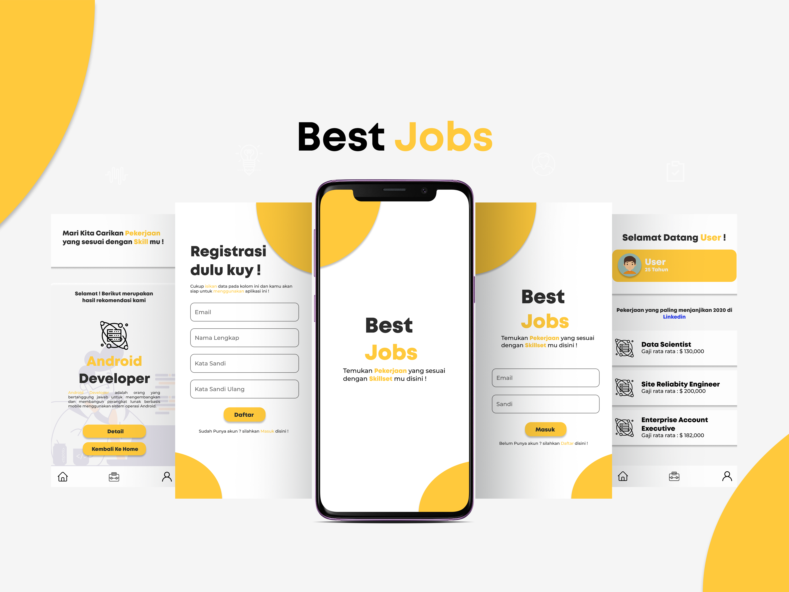

## Best Jobs
Best Jobs is one of the applications that provide information about the job that related to user skills preferences, this application also includes some learning resources for improving skills with the related job that the user wants.

 

## Background

The background of the best jobs application is that many users find it difficult to determine jobs that match their skills. Apart from that, some users have several skills but are still hesitant in choosing a suitable job based on the skills they have. With this application, the system will recommend any suitable skills based on user input data in the form of desired jobs and vice versa.

## Features:
 - Users can input data about skills that appropriate with themselves
 - Users can find out what skill set is required in the available jobs.
 - The application will display jobs that match the input results in point number 1, namely the skills that are in accordance with the user.
 - The application will display what skill requirements are needed in accordance with the input in point 3, namely jobs that are in accordance with the user 

## Members:  
 - :octocat: Fauzi Dzulfiqar Wibowo
 - :octocat: Lukman Riyadi
 - :octocat: Rochi Eko Pambudi
 - :octocat: Giffari Halika Utama

##  :wrench: Tools
 - React Native V6.3
 - Firebase
